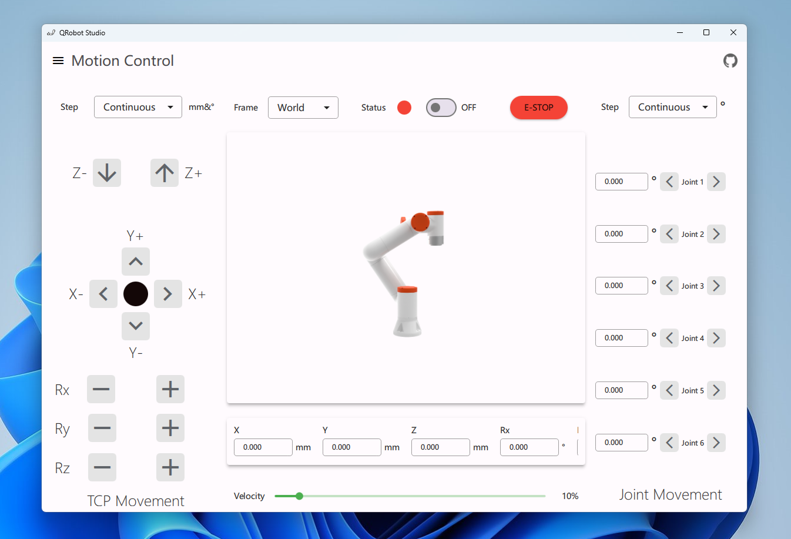

<div align="center">
    <h1>QRobot Studio</h1>
</div>
<p align="center">
<a href="README.md">English</a> | 简体中文
</p>
<div align="center"><p>基于Qt Quick编写的一个机器人控制软件，纯属个人兴趣</p></div>
<div align="center"></div>

## 怎么使用捏

从`Release`页面可以下载预编译的安装包，安装之后运行就行。文档嘛，在慢慢更新


## 从源码开凎

如果你喜欢从源码开始凎，跟随以下步骤即可

### 环境要求

+ Qt 6 (>= 6.2 LTS ，推荐 6.5 LTS)。 必须要的组件: core, QtQuick, QuickControls2, LinguistTools，一般直接用`Qt Maintenance Tool`安装即可。
+ 你的C++ 编译器必须支持 `c++17`。 (推荐MSVC 2019, GCC 9, Clang 11) 

### 编译步骤

+ 克隆仓库:

```Shell
git clone https://github.com/parker-int64/QRobotSutdio
```

+ 使用IDE：Qt Creator或者是CLion,将`CMakeLists.txt`作为项目打开

+ 编译工程，然后尝试执行。